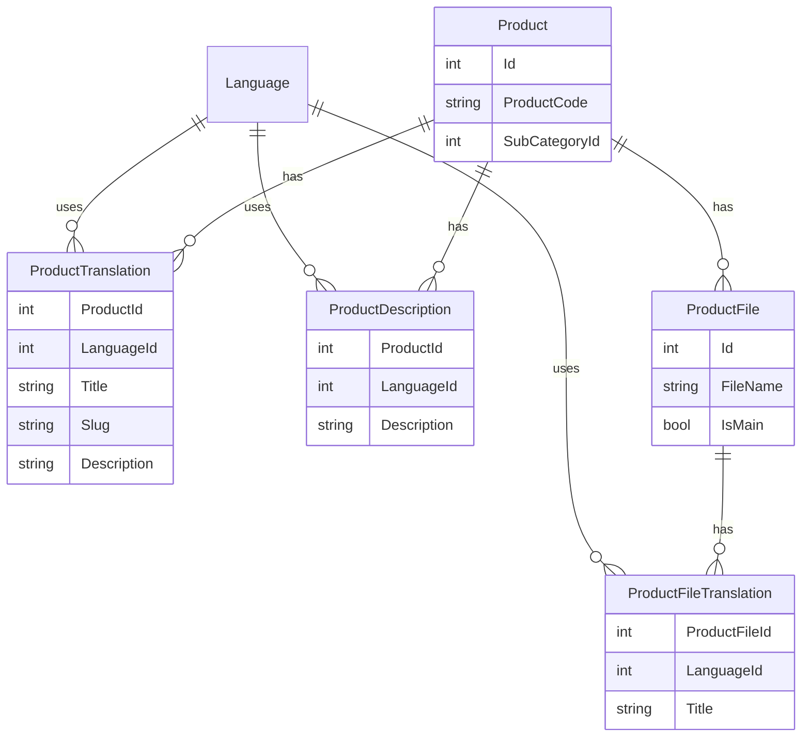

# پلن چندزبانگی جداول (Database i18n)

> **هدف:** قبل از هر پیاده‌سازی، مشخص کنیم **کدام جدول‌ها** به چندزبانگی نیاز دارند، **با چه الگویی**، و **در چه مرحله‌ای** هستیم.
>
> **وضعیت کلی:** 🟢 فاز ۰ (برنامه‌ریزی) — **تأیید شد** — پیاده‌سازی شروع نشده
>
> **آخرین به‌روزرسانی:** ۱۵ ژوئیه ۲۰۲۶ (جلسه ۹ — فقط Redis؛ API زبان در فاز بعد)
>
> **⚠️ پیاده‌سازی:** شروع نشده — تا تکمیل شفافیت مستندات، کدی نوشته نمی‌شود.
>
> **مرتبط:** `docs/project-status.md` — وضعیت کلی پروژه

---

## فهرست

1. [وضعیت فعلی](#۱-وضعیت-فعلی)
2. [جدول `Language` (زیرساخت مشترک)](#۲-جدول-language-زیرساخت-مشترک)
3. [سه الگوی اصلی (و گزینه‌های دیگر)](#۳-سه-الگوی-اصلی)
4. [معیارهای تصمیم‌گیری](#۴-معیارهای-تصمیم‌گیری)
5. [دسته‌بندی جداول](#۵-دسته‌بندی-جداول)
6. [تصمیمات قطعی — خوشه Product](#۶-تصمیمات-قطعی--خوشه-product)
7. [تصمیمات قطعی — سایر موجودیت‌ها](#۷-تصمیمات-قطعی--سایر-موجودیت‌ها)
8. [جزئیات هر موجودیت (خلاصه)](#۸-جزئیات-هر-موجودیت-خلاصه)
9. [موضوعات باز برای بحث](#۹-موضوعات-باز-برای-بحث)
10. [قرارداد API](#۱۰-قرارداد-api)
11. [زیرساخت Language — Registry و کش](#۱۱-زیرساخت-language--registry-و-کش)
12. [`LocalizationSettings` و جدول `Language`](#۱۲-localizationsettings-و-جدول-language)
13. [فازهای پیشنهادی پیاده‌سازی](#۱۳-فازهای-پیشنهادی-پیاده‌سازی)
14. [ردیاب پیشرفت](#۱۴-ردیاب-پیشرفت)
15. [یادداشت‌های جلسات](#۱۵-یادداشت‌های-جلسات)

---

## ۱. وضعیت فعلی

### آنچه **الان** چندزبانگی دارد

| لایه | وضعیت | توضیح |
|------|--------|-------|
| پیام‌های API / Validation | ✅ | `Edition.Common` — `.resx` + `Accept-Language` (`fa-IR`, `en-US`) |
| Swagger / Docs UI | ✅ | برچسب دسته کنترلر، locale در header |
| **محتوای دیتابیس** | ❌ | هیچ فیلد `Culture` / `LanguageId` / جدول ترجمه وجود ندارد |
| Entityها | ❌ | همه متن‌ها تک‌زبانه ذخیره می‌شوند |

### فرهنگ‌های پشتیبانی‌شده (فعلی)

از `LocalizationSettings`:

- پیش‌فرض: `fa-IR`
- پشتیبانی: `fa-IR`, `en-US`

### نقش دو فیلد توضیحات محصول (تصمیم قطعی ✅)

| محل | نقش | نوع متن | الگوی i18n |
|-----|------|---------|------------|
| `ProductTranslation.Description` | توضیح **مختصر** روی خود محصول | خلاصه / معرفی کوتاه | جدول ترجمه (الگو A) |
| `ProductDescription` | توضیح **جامع و کامل** | محتوای تفصیلی برای نمایش در جاهای دیگر سایت | `LanguageId` روی خود جدول (الگو B) |

این دو **جایگزین یکدیگر نیستند** — هر کدام کاربرد UI جدا دارند.

---

## ۲. جدول `Language` (زیرساخت مشترک)

### تصمیم قطعی ✅

به‌جای ذخیره رشته `Culture` در هر جدول ترجمه، یک جدول مرجع مرکزی داریم:

```
Language
├── Id
├── Code          ← fa-IR, en-US  (هم‌تراز CultureInfo و Accept-Language)
├── Name          ← «فارسی», «English»  (نمایش در پنل ادمین)
├── IsActive
├── IsDefault
├── DisplayOrder
└── IsRtl         ← اختیاری
```

**همه جداول ترجمه** از `LanguageId` (FK) استفاده می‌کنند.

| مزیت | توضیح |
|------|--------|
| یکپارچگی ارجاعی | زبان نامعتبر insert نمی‌شود |
| مدیریت | فعال/غیرفعال کردن زبان بدون deploy |
| پل با API | `Language.Code` ↔ `Accept-Language` ↔ `LocalizationSettings` |

**Seed اولیه:** `fa-IR` (IsDefault=true), `en-US`

---

## ۳. سه الگوی اصلی

### الگو A — جدول ترجمه مجزا (Translation Table)

```
Product (Id, ProductCode, SubCategoryId, ...)     ← داده غیرزبانی؛ Id در FKهای دیگر
ProductTranslation (ProductId, LanguageId, Title, Slug, Description)
```

| مزایا | معایب |
|-------|-------|
| جدول اصلی تمیز می‌ماند | JOIN اضافه در هر query |
| فیلدهای غیرزبانی یک‌بار ذخیره می‌شوند | CRUD پیچیده‌تر (master + translations) |
| افزودن زبان جدید بدون تغییر schema اصلی | نیاز به fallback وقتی ترجمه ناقص است |
| مناسب entityهای با فیلد ترجمه‌پذیر زیاد | Migration و seed سنگین‌تر |

**پیشنهاد برای:** کاتالوگ، CMS، بلاگ، propertyها

---

### الگو B — ردیف به ازای هر Culture در همان جدول (Culture Column)

```
Category (Id, Culture, Title, Slug, Code, ParentId?)
```

| مزایا | معایب |
|-------|-------|
| Query ساده‌تر (فیلتر `WHERE Culture = @culture`) | تکرار FKها و فیلدهای غیرزبانی |
| مناسب lookupهای کوچک | یکتایی (Unique) پیچیده‌تر — مثلاً `Slug` per culture |
| کم‌حجم برای جداول reference | رابطه parent/child بین cultureها مبهم می‌شود |

**پیشنهاد برای:** جداول کوچک reference با ۱–۲ فیلد متنی (`Currency`, `Bank`, `ExpenseType`)

---

### الگو C — بدون چندزبانگی DB

| دسته | دلیل |
|------|------|
| UGC (نظرات، استوری، آدرس کاربر) | متن توسط کاربر نوشته می‌شود — ترجمه سیستمی معنا ندارد |
| عملیاتی/مالی | `TransactionNumber`, `Description` حسابداری |
| فنی | FK، enum، URL درگاه، hash، IP |
| UI ادمین ثابت | `Permission.Title` — بهتر از `.resx` (الان همین‌طور است) |

---

### الگو D — JSON Locale Map (گزینه جایگزین — هنوز تصمیم نگرفته‌ایم)

```json
{ "fa-IR": { "title": "..." }, "en-US": { "title": "..." } }
```

| مزایا | معایب |
|-------|-------|
| بدون JOIN | جست‌وجو/index روی SQL Server سخت‌تر |
| یک migration | اعتبارسنجی و EF mapping پیچیده |
| مناسب فیلدهای کم | گزارش‌گیری و Content Policy سخت‌تر |

**وضعیت:** ⏸️ فعلاً خارج از پیشنهاد اصلی — فقط اگر تعداد فیلدها خیلی کم باشد بررسی شود.

---

## ۴. معیارهای تصمیم‌گیری

### قوانین انتخاب الگو ✅

| شرط | الگو | مثال |
|-----|------|------|
| `Entity.Id` در FK جداول دیگر استفاده می‌شود | **A** — master + `*Translation` | `Product`, `Category`, `Tag`, `Currency` |
| چند فیلد متنی per language | **A** | `BlogPost`, `Page`, `Property` |
| فایل/دارایی یک‌بار آپلود، فقط عنوان متفاوت | **A** — master + `*Translation` | `ProductFile` |
| حتی **یک فیلد** متنی، ولی `Id` در junction/FK است | **A** — نه B | `Tag`, `OrderItemAttachmentType`, `SectionType` |
| ردیف وابسته به parent؛ **یک** فیلد متنی؛ بدون FK به `Id` این ردیف | **B** — `LanguageId` روی خود جدول | `ProductDescription`, `ProductOrderItemAttachmentType` |
| فیلد غیرمتنی rule نباید per language تکرار شود | **A** — فقط `Description` در translation | `ProductPropertyRule` |
| UGC / مالی / فنی / پنل ادمین | **C** — بدون DB i18n | `BlogPostComment`, `User`, `Permission` |

**قانون کلی:** اگر `LanguageId` روی master بگذاریم و per language ردیف بسازیم، `Id` عوض می‌شود و **FKها می‌شکنند** → باید master + translation باشد.

**همه جداول ترجمه:** `EntityId` + `LanguageId` (FK → `Language`) + فیلدهای متنی.

---

| # | سوال | اگر بله → |
|---|------|-----------|
| 1 | آیا در **سایت عمومی** (public search/get) نمایش داده می‌شود؟ | اولویت بالا |
| 2 | آیا توسط **ادمین/CMS** مدیریت می‌شود؟ | کاندید ترجمه |
| 3 | آیا **کاربر نهایی** متنش را می‌نویسد؟ | ❌ بدون i18n DB |
| 4 | آیا `Slug` باید per-culture باشد؟ | تأثیر روی routing و SEO |
| 5 | چند فیلد ترجمه‌پذیر دارد؟ | ۱–۲ فیلد → شاید B؛ ۳+ → A |
| 6 | آیا در **Content Policy** فیلتر می‌شود؟ | باید در طراحی لحاظ شود |
| 7 | آیا **seed** زیاد دارد؟ | هزینه migration/seed |

### قاعده پیشنهادی اولیه (قابل تغییر پس از بحث)

```
اگر public-facing CMS/catalog  → الگو A
اگر lookup کوچک admin          → الگو B یا resx
اگر UGC / مالی / فنی           → الگو C
```

---

## ۵. دسته‌بندی جداول

### خلاصه آماری (به‌روز — جلسه ۳)

| دسته | تعداد | الگو |
|------|-------|------|
| 🟢 master + `*Translation` (الگو A) | **۳۰** | `*Translation` با `LanguageId` |
| 🟡 `LanguageId` روی خود جدول (الگو B) | **۲** | `ProductDescription`, `ProductOrderItemAttachmentType` |
| 🔵 فقط resx (بدون DB i18n) | **۵** | Role, Permission, ... |
| ⚪ بدون i18n | **۴۲** | UGC، junction، مالی، ... |

---

### 🟢 گروه ۱ — master + `*Translation` (الگو A)

| Entity | جدول ترجمه | فیلدهای ترجمه | Slug S2 |
|--------|------------|---------------|---------|
| `Category` | `CategoryTranslation` | Title | ✅ |
| `SubCategory` | `SubCategoryTranslation` | Title | ✅ |
| `Product` | `ProductTranslation` | Title, Slug, Description (مختصر) | ✅ |
| `ProductFile` | `ProductFileTranslation` | Title | — |
| `ProductFeatureType` | `ProductFeatureTypeTranslation` | Name, Description | — |
| `Property` | `PropertyTranslation` | Title, Description | — |
| `PropertyCategory` | `PropertyCategoryTranslation` | Title | — |
| `PropertyItem` | `PropertyItemTranslation` | Title | — |
| `ProductPropertyRule` | `ProductPropertyRuleTranslation` | Description | — |
| `OrderItemAttachmentType` | `OrderItemAttachmentTypeTranslation` | Title | — |
| `Page` | `PageTranslation` | Title, MetaTitle, MetaDescription, Slug | ✅ |
| `Section` | `SectionTranslation` | Title, Description, Url | — |
| `SectionType` | `SectionTypeTranslation` | Name | — |
| `SectionItem` | `SectionItemTranslation` | Title, Description, Url | — |
| `BlogPost` | `BlogPostTranslation` | Title, Slug, Content, MetaDescription, SeoKeywords | ✅ |
| `BlogPostCategory` | `BlogPostCategoryTranslation` | Title, Slug | ✅ |
| `Tag` | `TagTranslation` | Title | — |
| `DeliveryOption` | `DeliveryOptionTranslation` | Title | — |
| `DeliveryType` | `DeliveryTypeTranslation` | Title | — |
| `PostType` | `PostTypeTranslation` | Title, Description | — |
| `CommentTopic` | `CommentTopicTranslation` | Title | — |
| `Province` | `ProvinceTranslation` | Name, Description, Slug | ✅ |
| `City` | `CityTranslation` | Name, Description, Slug | ✅ |
| `Currency` | `CurrencyTranslation` | Name | — |
| `Bank` | `BankTranslation` | Title | — |
| `ChartOfAccount` | `ChartOfAccountTranslation` | AccountTitle | — |
| `ExpenseType` | `ExpenseTypeTranslation` | Title | — |
| `Company` | `CompanyTranslation` | Description | — |

> **`Company.Name`** روی master می‌ماند (نام برند/حقوقی). فقط `Description` عمومی در translation.

---

### 🟡 گروه ۲ — `LanguageId` روی خود جدول (الگو B)

| Entity | فیلدها | Unique |
|--------|--------|--------|
| `ProductDescription` | ProductId, LanguageId, Description (جامع) | `(ProductId, LanguageId)` |
| `ProductOrderItemAttachmentType` | ProductId, OrderItemAttachmentTypeId, LanguageId, Description | `(ProductId, OrderItemAttachmentTypeId, LanguageId)` |

---

### 🔵 گروه ۳ — فقط resx — بدون DB

| Entity | فیلد | دلیل |
|--------|------|------|
| `Role` | Title | فقط پنل ادمین |
| `Permission` | Title | از enum/attribute + resx |
| `ContentPolicy` | Name | پنل ادمین |
| `FinancialYear` | Name | پنل — معمولاً عددی/تاریخی |
| `BankAccount` | Title | پنل مالی |

---

### ⚪ گروه ۴ — بدون چندزبانگی DB

#### ۴.۱ — Junction / فقط عدد و FK (۱۵ entity)

`ProductProperty`, `ProductPrice`, `ProductPriceDeliveryOption`, `ProductPropertyPrice`, `PropertyItemPrice`, `PropertyItemDependency`, `CompanyProduct`, `PageSection`, `BlogPostTag`, `UserRole`, `RolePermission`, `ContentPolicyRecordAccess`, `OrderCommission`, `OrderVat`, `ProductPriceDeliveryOption`

#### ۴.۲ — UGC — محتوای کاربر (۱۲ entity)

`BlogPostComment`, `ProductComment`, `CompanyComment`, `CompanyStory`, `CompanyStoryComment`, `Order`, `OrderItem`, `OrderItemProperty` (مقدار `Value`), `OrderItemAttachment`, `UserAddress`, `Wallet` (Title کاربر), `CompanyStoryItem`

#### ۴.۳ — عملیاتی / مالی / امنیتی (۱۴ entity)

`User`, `RefreshToken`, `UserSession`, `BankTransaction`, `WalletTransaction`, `FinancialDocument`, `FinancialDocumentDetail`, `Expense`, `ChequeTransaction`, `PosTransaction`, `Discount` (Code), `OrderNote`, `CompanyPosDevice`, `WebSiteSetting`

#### ۴.۴ — Content Policy rules

`ContentPolicyRule` — مقادیر rule؛ نه محتوای نمایشی

#### ۴.۵ — موارد خاص

| Entity | تصمیم | توضیح |
|--------|--------|-------|
| `ProductDescription` | ✅ الگو B | `LanguageId` روی خود جدول |
| `ProductOrderItemAttachmentType` | ✅ الگو B | `LanguageId` روی خود جدول |
| `ProductFile` | ✅ A + `ProductFileTranslation` | فایل در master؛ Title در translation |
| `BlogPostLike`, `CompanyStoryLike` | C | فقط IP/کاربر |

---

## ۶. تصمیمات قطعی — خوشه Product

### `Product` — master + `ProductTranslation` ✅

```
Product                          ProductTranslation
├── Id                           ├── ProductId (FK)
├── ProductCode                  ├── LanguageId (FK → Language)
├── SubCategoryId                ├── Title
├── IsActive, CreatedOnUtc, ...  ├── Slug          ← per language (SEO)
└── (بدون Title/Slug/Desc)       └── Description   ← توضیح مختصر
```

**Unique constraints:**
- `(ProductId, LanguageId)`
- `(LanguageId, Slug)`

**دلیل master جدا:** `Product.Id` در `OrderItem`, `ProductPrice`, `ProductProperty` و ... استفاده می‌شود.

---

### `ProductDescription` — `LanguageId` روی خود جدول ✅

```
ProductDescription
├── Id
├── ProductId
├── LanguageId (FK → Language)
└── Description    ← توضیح جامع و کامل (برای نمایش در جاهای دیگر سایت)
```

**Unique:** `(ProductId, LanguageId)` — هر محصول، یک توضیح جامع per language

**چرا جدول ترجمه جدا نیست:** فقط یک فیلد متنی دارد؛ ساختار ساده‌تر کافی است.

**تفاوت با `ProductTranslation.Description`:**

| | `ProductTranslation.Description` | `ProductDescription.Description` |
|--|----------------------------------|----------------------------------|
| **نقش** | مختصر / معرفی کوتاه | جامع / کامل / تفصیلی |
| **محل نمایش** | کارت محصول، لیست، خلاصه | صفحات جزئیات، بلوک‌های محتوایی جدا |

---

### `ProductFile` — master + `ProductFileTranslation` ✅

```
ProductFile                      ProductFileTranslation
├── Id                           ├── ProductFileId (FK)
├── ProductId                    ├── LanguageId (FK → Language)
├── FileName    ← مشترک          └── Title
├── IsMain
└── IsActive
```

**قانون:** فایل **یک‌بار** آپلود می‌شود (`FileName` در master). فقط `Title` per language ترجمه می‌شود.

**چرا `LanguageId` روی `ProductFile` نیست:** تکرار `FileName`/`IsMain`/`IsActive` per language باعث ناهمگامی در آپدیت/حذف فایل می‌شود.

---

### `ProductOrderItemAttachmentType` — `LanguageId` روی خود جدول ✅

```
ProductOrderItemAttachmentType
├── Id
├── ProductId
├── OrderItemAttachmentTypeId
├── LanguageId (FK → Language)
├── Description
└── Priority
```

**Unique:** `(ProductId, OrderItemAttachmentTypeId, LanguageId)`

**چرا الگو B:** فقط `Description` متنی است؛ `ProductId` و `OrderItemAttachmentTypeId` در master همان ردیف می‌مانند.

---

## ۷. تصمیمات قطعی — سایر موجودیت‌ها

### ۷.۱ — دسته‌بندی (`Category` / `SubCategory`) ✅

**درخت در master** — ساختار یکسان در همه زبان‌ها؛ فقط متن و Slug per language.

```
Category                         CategoryTranslation
├── Id                           ├── CategoryId
├── Code                         ├── LanguageId
└── IsActive                     ├── Title
                                 └── Slug

SubCategory                      SubCategoryTranslation
├── Id                           ├── SubCategoryId
├── CategoryId (FK)              ├── LanguageId
├── Code                         ├── Title
└── IsActive                     └── Slug
```

**Unique:** `(CategoryId, LanguageId)`, `(LanguageId, Slug)` — مشابه برای SubCategory

---

### ۷.۲ — Propertyها ✅

```
Property (master)                PropertyTranslation
├── Id, ParentId, PropertyCategoryId, Priority, PropertyType, IsActive
                                 ├── Title, Description + LanguageId

PropertyCategory (master)        PropertyCategoryTranslation → Title
PropertyItem (master)            PropertyItemTranslation → Title

ProductPropertyRule (master)     ProductPropertyRuleTranslation → Description
├── MinLength, MaxQuantity, ...  (فیلدهای rule تکرار نمی‌شوند per language)
```

---

### ۷.۳ — CMS (`Page`, `Section`, `SectionItem`) ✅

```
Page (master)                    PageTranslation
├── Id, Type, IsActive           ├── Title, MetaTitle, MetaDescription, Slug + LanguageId

Section (master)                 SectionTranslation
├── Id, ParentId, SectionTypeId, ImageUrl, dates, IsActive
                                 ├── Title, Description, Url + LanguageId

SectionType (master)             SectionTypeTranslation → Name + LanguageId
SectionItem (master)             SectionItemTranslation → Title, Description, Url + LanguageId
```

`ImageUrl` در master — تصویر مشترک؛ `Url` در translation — لینک per language.

---

### ۷.۴ — بلاگ ✅

```
BlogPost (master)                BlogPostTranslation
├── BlogPostCategoryId, UserId, dates, flags, ReadingTimeInMinutes
                                 ├── Title, Slug, Content, MetaDescription, SeoKeywords + LanguageId

BlogPostCategory (master)        BlogPostCategoryTranslation → Title, Slug + LanguageId
Tag (master)                     TagTranslation → Title + LanguageId
```

`BlogPostTag` junction بدون تغییر — به `Tag.Id` اشاره می‌کند.

---

### ۷.۵ — مکان و ارسال ✅

```
Province (master)                ProvinceTranslation → Name, Description, Slug
├── TelPrefix, coordinates

City (master)                    CityTranslation → Name, Description, Slug
├── ProvinceId, coordinates

DeliveryOption (master)          DeliveryOptionTranslation → Title
DeliveryType (master)            DeliveryTypeTranslation → Title
PostType (master)                PostTypeTranslation → Title, Description
CommentTopic (master)            CommentTopicTranslation → Title
```

---

### ۷.۶ — مرجع مالی ✅

> **نکته:** `Currency.Id` در `ProductPropertyPrice` و ... FK است → **master + translation**، نه ردیف جدا per language.

```
Currency (master)                CurrencyTranslation → Name
├── Code, IsDefault

Bank (master)                    BankTranslation → Title
├── Icon

ChartOfAccount (master)          ChartOfAccountTranslation → AccountTitle
├── AccountCode

ExpenseType (master)             ExpenseTypeTranslation → Title
```

---

### ۷.۷ — شرکت ✅

```
Company (master)
├── Name          ← نام برند/حقوقی — تک‌زبانه
├── Code, Address, Phone, CityId, coordinates, ...

CompanyTranslation
├── CompanyId, LanguageId
└── Description   ← توضیح عمومی نمایش‌داده‌شده در سایت
```

---

### ۷.۸ — `ProductFeatureType` ✅

```
ProductFeatureType (master)      ProductFeatureTypeTranslation
├── Type, DataType, IsActive     ├── Name, Description + LanguageId
```

---

## ۸. جزئیات هر موجودیت (خلاصه)

> **راهنما:** ✅=نیاز i18n | ❌=بدون i18n | ⏳=باز | A/B/C=الگو

### کاتالوگ و محصول

| Entity | i18n | الگو | فیلدها | Slug |
|--------|------|------|--------|------|
| Category | ✅ | A | Title, Slug | ✅ S2 |
| SubCategory | ✅ | A | Title, Slug | ✅ S2 |
| Product | ✅ | A | Title, Description (مختصر), Slug | ✅ S2 |
| ProductDescription | ✅ | B | Description (جامع) + LanguageId | — |
| ProductFile | ✅ | A | Title در `ProductFileTranslation` | — |
| ProductFeatureType | ✅ | A | Name, Description | — |
| Property | ✅ | A | Title, Description | — |
| PropertyCategory | ✅ | A | Title | — |
| PropertyItem | ✅ | A | Title | — |
| ProductProperty | ❌ | — | — | — |
| ProductPropertyRule | ✅ | A | Description در translation | — |
| PropertyItemDependency | ❌ | — | — | — |
| ProductPrice* | ❌ | — | — | — |
| ProductOrderItemAttachmentType | ✅ | B | Description + LanguageId | — |
| OrderItemAttachmentType | ✅ | A | Title | — |
| OrderItemAttachmentTypeRestriction | ❌ | — | — | — |
| Tag | ✅ | A | Title | — |
| CommentTopic | ✅ | A | Title | — |

### CMS

| Entity | i18n | الگو | فیلدها | Slug |
|--------|------|------|--------|------|
| Page | ✅ | A | Title, MetaTitle, MetaDescription, Slug | ✅ S2 |
| PageSection | ❌ | — | — | — |
| Section | ✅ | A | Title, Description, Url | — |
| SectionType | ✅ | A | Name | — |
| SectionItem | ✅ | A | Title, Description, Url | — |

### بلاگ

| Entity | i18n | الگو | فیلدها | Slug |
|--------|------|------|--------|------|
| BlogPost | ✅ | A | Title, Content, Meta*, SeoKeywords, Slug | ✅ S2 |
| BlogPostCategory | ✅ | A | Title, Slug | ✅ S2 |
| BlogPostTag | ❌ | — | — | — |
| BlogPostComment | ❌ | UGC | Content | — |
| BlogPostLike | ❌ | — | — | — |

### مکان / مرجع

| Entity | i18n | الگو | فیلدها | Slug |
|--------|------|------|--------|------|
| Province | ✅ | A | Name, Description, Slug | ✅ S2 |
| City | ✅ | A | Name, Description, Slug | ✅ S2 |
| Currency | ✅ | A | Name در translation | — |
| DeliveryOption | ✅ | A | Title | — |
| DeliveryType | ✅ | A | Title | — |
| PostType | ✅ | A | Title, Description | — |

### شرکت / استوری

| Entity | i18n | الگو | فیلدها |
|--------|------|------|--------|
| Company | ✅ | A | Description در translation؛ Name در master | — |
| CompanyProduct | ❌ | — | — |
| CompanyStory | ❌ | UGC | Caption |
| CompanyStoryItem | ❌ | — | FileName |
| CompanyStoryComment | ❌ | UGC | Content |
| CompanyStoryLike | ❌ | — | — |
| CompanyComment | ❌ | UGC | Title, Description |
| CompanyPosDevice | ❌ | — | Name, Description (عملیاتی) |

### سفارش / تخفیف

| Entity | i18n | الگو |
|--------|------|------|
| Order | ❌ | UGC |
| OrderItem | ❌ | UGC |
| OrderItemProperty | ❌ | مقدار کاربر |
| OrderItemAttachment | ❌ | — |
| OrderNote | ❌ | یادداشت داخلی |
| Discount | ❌ | Code یکتا |

### کاربر / دسترسی

| Entity | i18n | الگو |
|--------|------|------|
| User | ❌ | PII |
| UserAddress | ❌ | UGC |
| Role | 🔵 | resx |
| Permission | 🔵 | resx |
| UserRole | ❌ | — |
| RolePermission | ❌ | — |
| RefreshToken | ❌ | — |
| UserSession | ❌ | — |

### مالی

| Entity | i18n | الگو |
|--------|------|------|
| Bank | ✅ | A | Title در translation | — |
| BankAccount | 🔵 | resx | — |
| BankTransaction | ❌ | — | — |
| ChartOfAccount | ✅ | A | AccountTitle در translation | — |
| ExpenseType | ✅ | A | Title در translation | — |
| Expense | ❌ | — |
| FinancialYear | 🔵 | resx |
| FinancialDocument* | ❌ | — |
| Wallet | ❌ | عنوان کاربر |
| WalletTransaction | ❌ | — |
| ChequeTransaction | ❌ | — |
| PosTransaction | ❌ | — |

### سیستم

| Entity | i18n | الگو |
|--------|------|------|
| ContentPolicy | 🔵 | resx |
| ContentPolicyRule | ❌ | — |
| ContentPolicyRecordAccess | ❌ | — |
| WebSiteSetting | ❌ | تماس/secret — نه i18n |

---

## ۹. تصمیمات تکمیلی و موضوعات باقی‌مانده

بیشتر موارد بسته شده‌اند. موارد ⏸️ عمداً به فاز پیاده‌سازی موکول شده‌اند.

### ۹.۱ — استراتژی Slug ✅ (تصمیم قطعی)

**تصمیم: S2 — Slug per language در جدول ترجمه**

| Entity | Slug per language |
|--------|-------------------|
| `Product` | ✅ |
| `Category`, `SubCategory` | ✅ |
| `Page` | ✅ |
| `BlogPost`, `BlogPostCategory` | ✅ |
| `Province`, `City` | 🟡 اختیاری — غالباً نام محلی |

**URL پیشنهادی:** `/fa/products/{slug-fa}` و `/en/products/{slug-en}`

**Unique:** `(LanguageId, Slug)` — نه globally

**Fallback:** اگر ترجمه/`slug` برای زبان درخواستی نبود → `Language.IsDefault` (`fa-IR`)

**Entityهای دارای Slug:** `Category`, `SubCategory`, `Product`, `Page`, `BlogPost`, `BlogPostCategory`, `Province`, `City`

---

### ۹.۲ — `Product` vs `ProductDescription` ✅ (بسته شد)

**تصمیم P1 (اصلاح‌شده):** توضیح مختصر در `ProductTranslation`؛ توضیح جامع در `ProductDescription` با `LanguageId` روی خود جدول.

جزئیات: [بخش ۶](#۶-تصمیمات-قطعی--خوشه-product)

---

### ۹.۳ — درخت دسته‌بندی (`Category` / `SubCategory`) ✅ (بسته شد)

**تصمیم:** Master entity + Translation — `ParentId`/`CategoryId` در master؛ ساختار درخت یکسان در همه زبان‌ها.

جزئیات: [بخش ۷.۱](#۷۱--دسته‌بندی-category--subcategory-)

---

### ۹.۴ — `Company` ✅ (بسته شد)

**تصمیم:** `Name` در master؛ فقط `Description` در `CompanyTranslation`.

---

### ۹.۵ — Fallback وقتی ترجمه نیست ✅

**تصمیم: F1** — fallback به زبان پیش‌فرض (`Language.IsDefault` → `fa-IR`) در public API.

---

### ۹.۶ — استراتژی Migration داده موجود ⏸️

**تصمیم:** فعلاً طراحی/اجرا **نمی‌شود** — بعد از شروع پیاده‌سازی و مشخص شدن schema نهایی بررسی می‌شود.

> داده فعلی تک‌زبانه (فارسی) است؛ هنگام پیاده‌سازی تصمیم می‌گیریم چگونه به `Language`/`Translation` منتقل شود.

---

### ۹.۷ — API Contract ✅

جمع‌بندی در [بخش ۱۰](#۱۰-قرارداد-api) — به‌روز جلسه ۵.

---

### ۹.۸ — Content Policy + i18n ⏸️

**تصمیم:** فعلاً کاری نمی‌شود — بعداً بررسی می‌شود که فیلتر روی کدام `LanguageId` اعمال شود.

(محدوده کلی همچنان فقط `GetAll`/`Search` است — جزئیات i18n بعداً.)

---

### ۹.۹ — Language Registry و کش ✅

جزئیات در [بخش ۱۱](#۱۱-زیرساخت-language--registry-و-کش).

---

## ۱۰. قرارداد API

### ۱۰.۱ — تفکیک `GetAll` vs `Search` ✅

| متد | مخاطب | زبان در خروجی |
|-----|--------|----------------|
| **`GetAll`** | **ادمین** (احراز + permission) | **همه زبان‌ها** |
| **`Search`** | **عموم / سایت** (بدون احراز) | **فقط culture جاری** |

> این تفکیک از قبل در پروژه وجود دارد؛ با i18n حفظ می‌شود.

---

### ۱۰.۲ — Public API (`Search` و خواندن تکی)

| موضوع | تصمیم |
|-------|--------|
| انتخاب زبان | `Accept-Language` → `Language.Code` (از Registry) |
| بدون header | fallback به `Language.IsDefault` از Registry/DB |
| `Search` | فقط ترجمه `LanguageId` جاری (+ fallback به default اگر نبود) |
| `Get` / `get-by-slug` | همان زبان جاری |
| ترجمه‌ها در response | **نه** — فیلدهای resolved همان زبان |

**هم‌ترازی اولیه با `LocalizationSettings`:**

- فقط **بار اول / seed** — `SupportedCultures` → ردیف‌های `Language`
- **Runtime:** `Language.IsDefault` و `IsActive` از DB — نه خواندن مکرر appsettings

---

### ۱۰.۳ — Admin API — `GetAll` ✅

لیست ادمین: **همه ترجمه‌ها** per entity (یا ساختار nested) — بدون فیلتر به یک `LanguageId`.

جزئیات دقیق shape پاسخ UI — هنگام پیاده‌سازی؛ اصل: ادمین در لیست همه زبان‌ها را می‌بیند.

---

### ۱۰.۴ — Admin API — `Create` / `Update` ✅

**تصمیم جلسه ۵:** در مدل ورودی **فقط یک `LanguageId`** — نه آرایه `translations[]`.

```json
{
  "languageId": 1,
  "productCode": "P-001",
  "subCategoryId": "...",
  "title": "کارت ویزیت",
  "slug": "کارت-ویزیت",
  "description": "توضیح مختصر",
  "isActive": true
}
```

| قانون | توضیح |
|-------|--------|
| `languageId` | الزامی — مشخص می‌کند این ذخیره برای کدام زبان است |
| فیلدهای متنی | فقط همان زبان upsert می‌شود (`*Translation` یا الگو B) |
| master fields | `ProductCode`, FKها, flags — یک‌بار در master |
| زبان دیگر | درخواست جدا با `languageId` دیگر (از UI ادمین) |

**ساده و صریح:** هر save = یک زبان. فرم ادمین می‌تواند tab per language داشته باشد؛ هر tab یک request.

---

### ۱۰.۵ — Admin API — `Get` (تکی) ✅

**تصمیم جلسه ۶:** فعلاً **فقط culture/زبان جاری** — مثل `Search`، نه همه زبان‌ها.

| متد | مخاطب | زبان در خروجی |
|-----|--------|----------------|
| `Get` (ادمین) | ادمین | **فقط `LanguageId` جاری** (از `Accept-Language` / پیش‌فرض) |
| `GetAll` (ادمین) | ادمین | **همه زبان‌ها** |

> بعداً در صورت نیاز UI می‌توان به «همه زبان‌ها در یک response» تغییر داد.

---

### ۱۰.۶ — Content Policy (بدون جزئیات i18n فعلاً)

محدوده کلی: فقط **`GetAll`** و **`Search`**.  
**جزئیات فیلتر روی کدام زبان:** ⏸️ بعداً (جلسه ۵).

---

## ۱۱. زیرساخت Language — Registry و کش

### ۱۱.۱ — اهداف

- Repository **`languageId` در signature نگیرد**
- `Culture` کاربر → `LanguageId` از Registry resolve شود
- لیست زبان **فقط از Redis** (`IDistributedCache`) — **بدون** `IMemoryCache` و **بدون** Pub/Sub
- بدون JOIN به جدول `Language` در queryهای ترجمه

---

### ۱۱.۲ — قطعات (بدون پیاده‌سازی — طراحی)

```
┌─────────────────────────────────────────────────────────┐
│  HTTP Request                                            │
│  Accept-Language (یا نبود → زبان پیش‌فرض از Registry/DB)   │
└────────────────────┬────────────────────────────────────┘
                     ▼
┌─────────────────────────────────────────────────────────┐
│  Middleware → ICurrentLanguageContext (Scoped)          │
│  LanguageId, LanguageCode برای همین request             │
└────────────────────┬────────────────────────────────────┘
                     ▼
┌─────────────────────────────────────────────────────────┐
│  ILanguageRegistry (Singleton)                            │
│  Code ↔ Id — از Redis (فعلاً)                            │
└────────────────────┬────────────────────────────────────┘
                     ▼
┌─────────────────────────────────────────────────────────┐
│  Repository                                              │
│  Search → context.LanguageId                             │
│  GetAll (admin) → همه ترجمه‌ها (بدون فیلتر زبان)         │
└─────────────────────────────────────────────────────────┘
```

| سرویس | Lifetime | نقش |
|--------|----------|-----|
| `ICurrentLanguageContext` | **Scoped** | `LanguageId` این request |
| `ILanguageRegistry` | **Singleton** | resolve + invalidate |
| `IDistributedCache` | — | Redis — **تنها** لایه کش زبان |

**Repository به `HttpContext` وصل نمی‌شود** — فقط `ICurrentLanguageContext`.

> ~~`IMemoryCache` / Pub/Sub~~ — **لغو شد** (جلسه ۹). چند instance: همه از همان Redis می‌خوانند.

---

### ۱۱.۳ — کش Redis ✅

**تصمیم نهایی:** **فقط Redis** — بدون memory cache، بدون Pub/Sub.

#### خواندن

```
1. Redis  → edition:languages:data (+ edition:languages:version)
2. DB     → cache miss
```

#### کلیدهای Redis

| Key | محتوا |
|-----|--------|
| `edition:languages:version` | عدد صحیح — با تغییر seed/ادمین (فاز بعد) `INCR` |
| `edition:languages:data` | JSON لیست کامل زبان‌ها |

#### Invalidate (چند instance)

`INCR version` + `SET/DEL data` در Redis — **همه instanceها** مستقیم از Redis می‌خوانند؛ نیازی به همگام‌سازی memory نیست.

#### API مدیریت زبان (ادمین)

**فاز ۱:** فقط seed از `LocalizationSettings` — **بدون** CRUD ادمین.  
**فاز بعدی:** API ادمین `Language` + invalidate Redis در handler.

---

### ۱۱.۴ — رفتار Repository بر اساس نوع query

| متد | منبع زبان | رفتار |
|-----|-----------|--------|
| `SearchAsync` | `ICurrentLanguageContext.LanguageId` | JOIN translation + fallback default |
| `GetAllAsync` (admin) | — | همه `*Translation` / همه `LanguageId` |
| `Create` / `Update` | **`LanguageId` از request body** | upsert همان زبان — مستقل از context |
| `GetByIdAsync` (admin Get) | `ICurrentLanguageContext.LanguageId` | فقط زبان جاری — فعلاً |

---

### ۱۱.۵ — مسیر بدون HTTP

وقتی **درخواست HTTP نیست** (Seed، تست، job):

- Registry → `GetDefaultLanguage()` از DB (`Language.IsDefault`) — نه از `appsettings` در runtime

---

### ~~۱۱.۸ — کش L1 Memory~~ ❌ لغو شد

طراحی L1 + Pub/Sub **انجام نمی‌شود** — فقط Redis (جلسه ۹).

---

## ۱۲. `LocalizationSettings` و جدول `Language`

### ۱۲.۰ — تصمیم قطعی تأیید‌شده ✅

```
appsettings.LocalizationSettings  →  seed / bootstrap / مستند deploy
DB Language + Redis               →  runtime (همه requestها)
```

| سوال | جواب قطعی |
|------|-----------|
| `LocalizationSettings` **حذف** شود؟ | **خیر** — در `appsettings` می‌ماند |
| **Runtime** از appsettings بخواند؟ | **خیر** — از DB/Redis (`ILanguageRegistry`) |
| **Seed** از appsettings؟ | **بله** — وقتی جدول `Language` خالی است |
| ادمین زبان را کجا عوض کند؟ | **DB** (بعداً API ادمین) — نه appsettings |

---

### ۱۲.۱ — مشکل: دو منبع؟

الان در `appsettings`:

```json
"LocalizationSettings": {
  "DefaultCulture": "fa-IR",
  "DefaultUICulture": "fa-IR",
  "SupportedCultures": [ "fa-IR", "en-US" ],
  "SupportedUICultures": [ "fa-IR", "en-US" }
}
```

استفاده فعلی: `AddEditionLocalization` → `RequestLocalizationOptions` (پیام‌های `.resx`، `Accept-Language`).

با جدول `Language` (`Code`, `IsDefault`, `IsActive`, ...) — **نباید دو source of truth جدا در runtime داشته باشیم.**

---

### ۱۲.۲ — تصمیم: نقش هر کدام ✅

| منبع | نقش | زمان |
|------|-----|------|
| **`Language` (DB + Redis)** | **Source of truth در runtime** | همیشه بعد از seed |
| **`LocalizationSettings` (appsettings)** | **فقط bootstrap / seed اولیه** | اولین بار یا DB خالی |

**قانون:** بعد از seed، تغییر زبان (پیش‌فرض، فعال/غیرفعال، اضافه کردن) **فقط از ادمین/DB** — تغییر `appsettings` به‌تنهایی روی runtime اثر ندارد.

---

### ۱۲.۳ — نگاشت فیلدها

| `LocalizationSettings` | `Language` (DB) |
|------------------------|-----------------|
| `DefaultCulture` | ردیفی که `IsDefault = true` → `Code` |
| `DefaultUICulture` | همان ردیف (در Edition معمولاً یکی است) |
| `SupportedCultures[]` | همه ردیف‌های `IsActive = true` → `Code` |
| `SupportedUICultures[]` | همان مجموعه `IsActive` |

---

### ۱۲.۴ — جریان Startup (طراحی)

```
1. App start
2. Language Registry → Redis → (miss) → DB
3. اگر جدول Language خالی:
     Seed از LocalizationSettings
     → INSERT fa-IR (IsDefault), en-US, ...
     → پر کردن Redis
4. پیکربندی RequestLocalizationOptions از Registry/DB:
     DefaultCulture      ← Language where IsDefault
     SupportedCultures   ← Language where IsActive
5. Middleware Accept-Language:
     → Registry.GetByCode → LanguageId
     → اگر نامعتبر/غیرفعال → default از DB
```

---

### ۱۲.۵ — دو لایه Localization در پروژه

| لایه | منبع | مثال |
|------|------|------|
| **UI/API messages** | `.resx` + `RequestLocalizationOptions` | خطاهای validation، `EnumResources` |
| **محتوای DB** | `*Translation` + `LanguageId` | Title محصول، Slug، ... |

**هر دو** باید همان `Code`ها (`fa-IR`, `en-US`) را استفاده کنند — از جدول `Language` می‌آید، نه دو config جدا.

---

### ۱۲.۶ — تغییر `AddEditionLocalization` (هنگام پیاده‌سازی)

الان: مستقیم از `IConfiguration` می‌خواند.

بعداً (یکی از این دو — هنگام کد):

| گزینه | توضیح |
|-------|--------|
| **A (پیشنهاد)** | بعد از seed، `Configure<RequestLocalizationOptions>` از `ILanguageRegistry` / DB |
| **B** | `IConfigureOptions<RequestLocalizationOptions>` که از Registry می‌خواند |

`LocalizationSettings` در DI **باقی می‌ماند** — فقط برای **SeedService** و مستندات deploy اولیه.

---

### ۱۲.۷ — `appsettings` — نگه دارید، نقشش seed است

```json
"LocalizationSettings": {
  "DefaultCulture": "fa-IR",
  "DefaultUICulture": "fa-IR",
  "SupportedCultures": [ "fa-IR", "en-US" ],
  "SupportedUICultures": [ "fa-IR", "en-US" ]
}
```

| | |
|--|--|
| ✅ **نگه دارید** | seed، env جدید، مستندات تیم |
| ❌ **حذف نکنید** (فعلاً) | تا seed جای دیگر ثابت نشده |
| ❌ **runtime نخوانید** | بعد از پیاده‌سازی i18n DB — middleware و Registry از Redis/DB |
| ℹ️ تغییر appsettings بعد از deploy | روی زبان‌های **در حال اجرا** اثر ندارد — فقط seed بعدی/env جدید |

**خلاصه یک خط:** `LocalizationSettings` = **ورودی اولیه**؛ `Language` = **حقیقت در زمان اجرا**.

---

## ۱۳. فازهای پیشنهادی پیاده‌سازی

> ✅ **فاز ۱ پیاده‌سازی شد** — زیرساخت Language

| فاز | عنوان | محدوده | وضعیت |
|-----|--------|--------|--------|
| **۰** | برنامه‌ریزی و تصمیم‌گیری | همین سند | ✅ تأیید شد |
| **۱** | زیرساخت Language | `Language`، Registry، Redis، middleware، seed — **بدون** API ادمین زبان | ✅ |
| **۱.۵** | API ادمین `Language` | CRUD + تغییر پیش‌فرض + invalidate Redis | ⏳ بعداً |
| **۲** | پایلوت — Lookup کوچک | `DeliveryType`, `PostType` (ساده، public) | ⏳ |
| **۳** | کاتالوگ هسته | `Category`, `SubCategory`, `Product` + `ProductDescription` + `ProductFile` | ⏳ |
| **۴** | Propertyها | `Property`, `PropertyItem`, rules | ⏳ |
| **۵** | CMS | `Page`, `Section`, `SectionItem` | ⏳ |
| **۶** | بلاگ | `BlogPost`, `BlogPostCategory`, `Tag` | ⏳ |
| **۷** | مکان | `Province`, `City` | ⏳ |
| **۸** | بقیه entityها + seed | Currency, Bank, Company, ... | ⏳ |
| **۸.۵** | Migration داده موجود | ⏸️ بعداً — خارج از scope فعلی | ⏸️ |
| **۹** | Content Policy (GetAll/Search) + Cache + تست | محدود به list/search | ⏳ |

### خروجی فاز ۱ (Definition of Done)

- [x] `ILanguageRegistry` + Redis (`IDistributedCache`) — **فقط Redis**
- [x] Seed `Language` از `LocalizationSettings` (اولین بار)
- [x] `RequestLocalizationOptions` از DB/Registry — نه runtime از appsettings
- [x] `ICurrentLanguageContext` + middleware
- [x] Migration `AddLanguageTable`
- [x] تست‌های `LanguageCultureNormalizer` و `CurrentLanguageContext`

### خروجی فازهای بعدی (Definition of Done)

- [ ] Entity + Translation + Migration
- [ ] Repository: `Search` از context؛ `GetAll` همه زبان‌ها؛ CUD با `languageId` در body
- [ ] Public `Search` — زبان جاری + fallback
- [ ] Admin `GetAll` — همه زبان‌ها
- [ ] تست fallback و registry

---

## ۱۴. ردیاب پیشرفت

### وضعیت کلی پروژه i18n DB

```
[████████████████████] فاز ۰ — ✅ تأیید شد
[████████████████████] فاز ۱ — ✅ زیرساخت Language
```

| مرحله | وضعیت | تاریخ |
|-------|--------|-------|
| فهرست entityها + الگو A/B/C | ✅ | ۱۴ ژوئیه ۲۰۲۶ |
| جدول `Language` + `LanguageId` | ✅ | ۱۴ ژوئیه ۲۰۲۶ |
| خوشه Product و سایر entityها | ✅ | ۱۴ ژوئیه ۲۰۲۶ |
| GetAll=ادمین همه زبان / Search=public یک زبان | ✅ | ۱۴ ژوئیه ۲۰۲۶ |
| CUD: یک `languageId` در body | ✅ | ۱۴ ژوئیه ۲۰۲۶ |
| Language Registry — فقط Redis | ✅ | ۱۵ ژوئیه ۲۰۲۶ |
| L1 memory + Pub/Sub | ❌ لغو | ۱۵ ژوئیه ۲۰۲۶ |
| API ادمین Language | ⏳ فاز ۱.۵ (بعد از فاز ۱) | ۱۵ ژوئیه ۲۰۲۶ |
| LocalizationSettings = seed؛ runtime = DB/Redis | ✅ تأیید نهایی | ۱۵ ژوئیه ۲۰۲۶ |
| فاز ۰ برنامه‌ریزی | ✅ | ۱۵ ژوئیه ۲۰۲۶ |
| استراتژی migration داده | ⏸️ بعداً | — |
| Cache culture-aware | ⏸️ هنگام پیاده‌سازی | — |
| پیاده‌سازی فاز ۱ | ✅ | ۱۵ ژوئیه ۲۰۲۶ |

### موضوعات باز

1. Content Policy + i18n — بعداً
2. Migration داده — ⏸️ بعداً

### Entityهای تصمیم‌گرفته‌شده (قطعی)

| گروه | Entityها | الگو |
|------|----------|------|
| زیرساخت | `Language` | جدول مرجع |
| کاتالوگ | `Category`, `SubCategory`, `Product`, `ProductFile`, `ProductFeatureType`, `ProductDescription`, `ProductOrderItemAttachmentType` | A / B |
| Property | `Property`, `PropertyCategory`, `PropertyItem`, `ProductPropertyRule`, `OrderItemAttachmentType` | A |
| CMS | `Page`, `Section`, `SectionType`, `SectionItem` | A |
| بلاگ | `BlogPost`, `BlogPostCategory`, `Tag` | A |
| مکان/ارسال | `Province`, `City`, `DeliveryOption`, `DeliveryType`, `PostType`, `CommentTopic` | A |
| مالی | `Currency`, `Bank`, `ChartOfAccount`, `ExpenseType` | A |
| شرکت | `Company` | A (فقط Description) |

### موضوعات عمداً به بعد موکول شده

| موضوع | وضعیت |
|-------|--------|
| Migration داده تک‌زبانه موجود → schema جدید | ⏸️ فاز ۸.۵ |
| Cache culture-aware | ⏸️ فاز ۹ |

---

## ۱۵. یادداشت‌های جلسات

### جلسه ۹ — ۱۵ ژوئیه ۲۰۲۶

**تصمیمات:**
- API مدیریت `Language` (ادمین) → **فاز ۱.۵** (بعد از زیرساخت فاز ۱)
- **L1 memory + Pub/Sub لغو شد** — فقط Redis؛ چند instance همگی از Redis می‌خوانند
- آماده شروع پیاده‌سازی فاز ۱ روی برنچ جدا

---

### جلسه ۸ — ۱۵ ژوئیه ۲۰۲۶

**تأیید نهایی:**
- `LocalizationSettings` در appsettings **باقی می‌ماند** — نقش: **seed / bootstrap**
- Runtime (middleware، Registry، Repository): **DB + Redis**
- فاز ۰ برنامه‌ریزی **بسته شد** — آماده شروع فاز ۱ (بدون کد تا دستور صریح)

---

### جلسه ۷ — ۱۴ ژوئیه ۲۰۲۶

**تصمیمات:**
- کش زبان: **فقط Redis** فعلاً — `IMemoryCache` بعداً
- `LocalizationSettings`: **فقط seed/bootstrap** — runtime از جدول `Language` (Redis/DB)
- `RequestLocalizationOptions` از Registry/DB پیکربندی شود
- `IsDefault` در DB = زبان پیش‌فرض runtime

---

### جلسه ۶ — ۱۴ ژوئیه ۲۰۲۶

**تصمیمات:**
- Admin `Get` تکی: فعلاً **فقط culture جاری** (ساده) — `GetAll` همچنان همه زبان‌ها
- مشکل invalidate L1 در چند instance: **Version Stamp در Redis** (اجباری) + **Pub/Sub** (فوری، توصیه‌شده)
- تغییر زبان پیش‌فرض / refresh کامل: `INCR version` + update data + `PUBLISH` → clear L1 همه instanceها

---

### جلسه ۵ — ۱۴ ژوئیه ۲۰۲۶

**تصمیمات:**
- `GetAll` = ادمین، همه زبان‌ها | `Search` = public، فقط culture جاری
- Create/Update: **یک `languageId`** در body — نه `translations[]`
- بدون `Accept-Language` → `Language.IsDefault` از Registry/DB
- Language Registry: Repository بدون `languageId` در signature؛ `ICurrentLanguageContext` scoped
- کش: **هیبرید L1 memory + Redis** (`IDistributedCache`)
- Content Policy + i18n: بعداً
- Invalidate Redis: وقتی ادمین Language را تغییر داد (جزئیات بعداً)

**سوال باز:** Admin `Get` تکی

---

### جلسه ۴ — ۱۴ ژوئیه ۲۰۲۶

**تصمیمات:**
- API ادمین: **همه زبان‌ها در یک request** (Create/Update/Get)
- Public API: یک زبان per response + `Accept-Language` + fallback
- Content Policy: **فقط GetAll و Search**
- Migration داده موجود: **فعلاً طراحی نشود** — بعداً
- **هنوز کد نزنیم** — اول شفافیت کامل مستندات

**اقدام بعدی:**
- [ ] تأیید نهایی سند → شروع فاز ۱ (زیرساخت `Language`)

---

### جلسه ۳ — ۱۴ ژوئیه ۲۰۲۶

**خلاصه:**
- الگوی A/B برای **همه** موجودیت‌های i18n نهایی شد
- ۳۰ entity → master + `*Translation`
- ۲ entity → `LanguageId` روی خود جدول (`ProductDescription`, `ProductOrderItemAttachmentType`)
- `Currency`, `Bank`, `SectionType` و ... به A منتقل شدند (به‌خاطر FK)
- `Category` tree در master؛ `Company.Name` در master

**اقدام بعدی:**
- [ ] قرارداد API ادمین
- [ ] شروع فاز ۱ — زیرساخت `Language` + EF pattern

---

### جلسه ۲ — ۱۴ ژوئیه ۲۰۲۶

**خلاصه:**
- جدول `Language` با `LanguageId` در جداول ترجمه تأیید شد
- Slug per language (S2) برای SEO تأیید شد
- خوشه Product طراحی شد

**تصمیمات:**
- `Product`: master + `ProductTranslation` (Title, Slug, Description مختصر)
- `ProductDescription`: `LanguageId` روی خود جدول — توضیح جامع (نقش جدا از Description مختصر محصول)
- `ProductFile`: master + `ProductFileTranslation` — فایل یک‌بار، Title per language

**اقدام بعدی:**
- [ ] بحث `Category` tree
- [ ] قرارداد API ادمین برای مدیریت ترجمه‌ها

---

### جلسه ۱ — ۱۴ ژوئیه ۲۰۲۶

**حاضرین:** —

**خلاصه:**
- شروع پلن چندزبانگی جداول
- سه الگو شناسایی شد: جدول ترجمه / culture در جدول / بدون i18n
- تحلیل اولیه ۷۹ entity انجام شد
- پیاده‌سازی شروع نشد — منتظر بحث و تکمیل تصمیمات بخش ۶

**تصمیمات:**
- (هنوز ثبت نشده)

**اقدام بعدی:**
- [ ] بحث Slug strategy (۶.۱)
- [ ] نهایی کردن گروه A vs B برای Province/City
- [ ] تصمیم ProductDescription

---

## پیوست: نمودار رابطه پیشنهادی (الگو A)



---

## پیوست: چک‌لیست قبل از شروع کد

- [x] Slug strategy نهایی شد (S2 per language)
- [x] جدول `Language` تأیید شد
- [x] خوشه Product finalize شد
- [x] `LocalizationSettings` = seed؛ runtime = DB/Redis — **تأیید نهایی**
- [x] فاز ۰ برنامه‌ریزی تکمیل شد
- [x] قرارداد API (admin: یک request؛ public: Accept-Language) نوشته شد
- [x] Content Policy scope (فقط GetAll/Search) مشخص شد
- [ ] استراتژی migration داده موجود — ⏸️ عمداً بعداً
- [ ] Content Policy JOIN translation — هنگام پیاده‌سازی فاز ۹

---

*این سند زنده است — پس از هر جلسه بحث یا شروع پیاده‌سازی به‌روز شود.*
